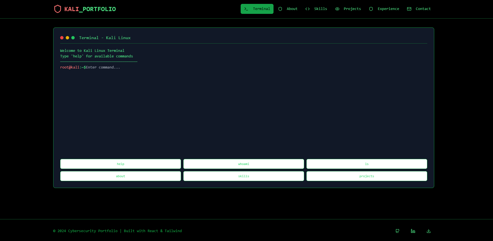

# 🧑‍💻 Cyber Terminal Portfolio View

A **Kali Linux-inspired portfolio website** that captures the dark, mysterious aesthetics of the cybersecurity world. Designed to resemble a hacker’s terminal, this portfolio features matrix-style animations, a sleek dark theme, and structured sections that showcase programming skills and professional background in a bold, unique way.

---

## 🧠 Features

- 🖥️ Dark Terminal Interface Inspired by Kali Linux
- 🧮 Matrix-style Text Effects
- 📁 Organized Sections: About, Projects, Skills, Contact
- 🧑‍💻 Focus on Cybersecurity & Programming Aesthetics
- 💻 Fully Responsive and Interactive Design

---

## 🧰 Built With

- ⚡ [Vite](https://vitejs.dev/) – Lightning-fast development
- 🟦 [TypeScript](https://www.typescriptlang.org/) – Type-safe JavaScript
- ⚛️ [React](https://reactjs.org/) – Component-based UI framework
- 🧩 [shadcn/ui](https://ui.shadcn.dev/) – Clean and accessible UI components
- 🎨 [Tailwind CSS](https://tailwindcss.com/) – Utility-first styling for complete design control

---

<!--
**Use Lovable**

Simply visit the [Lovable Project](https://lovable.dev/projects/b7448b5f-4429-49e4-ace9-f0387fa578da) and start prompting.

Changes made via Lovable will be committed automatically to this repo.
-->

## 📁 Project Structure

```yaml
/public
/src
├── components/ # Reusable UI components
├── pages/ # Main views like home, Products, about etc
├── hooks/ # Custom React hooks
├── utils/ # Helper functions
└── assets/ # Images and static files
```

---
<!--

## 📺 Live Demo

[🔗 View Live Portfolio](https://aniketmacfolio.vercel.app/)
---
Feel free to fork, explore, and customize this portfolio to make it your own!
---
--->

## Setup

Download [Node.js](https://nodejs.org/en/download/).
Run this followed commands:

```bash
# Step 1: Clone the repository using the project's Git URL.
git clone <THIS_GIT_URL>

# Step 2: Navigate to the project directory.
cd <YOUR_PROJECT_NAME>

# Step 3: Install dependencies (only the first time)
npm install

# Step 4: Run the local server at localhost:8080
npm run dev

# Step 5: Build for production in the dist/ directory
npm run build
```
## 📸 Preview


